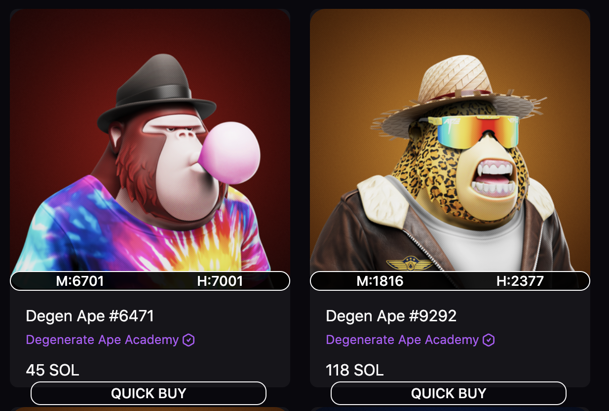

   
  
  <h1> Easily snipe best ranked NFTs!</h1>

 

  
  
  
  

S◎LSniperNFT allows you to easily see the ranks of the NFTs directly on your favorite Marketplaces.

## 🔥 Features

- Show ranks from howrare and moonrank on supported marketplaces.
  - Howrare own ranking system more info <a href="https://howrare.is/faq/#rarity_calculation">here </a>
  - Moonrank supports one type of ranking and this is calculated using statistical ranking system.
- Quick Buy button for Magiceden and Solanart Marketplaces.
  
## 📖 Extension Settings

- The extension pop-up allows you to :
  - Enable/Disable the Quick buy button.
  - Enable/Disable ranks to be shown.
  - Enter your own thresholds and colors for colouring ranks.
    

  - Open the popup in a new tab. 
  - Clear Cached Ranks Page:
    - Added option to clear the rankings.
    - Now in the popup you can go to the Ranks page and delete the collection you don't see that often or you added a new mapping for it and you want to refresh the ranks on the next page load.
    

  - Enter your own mappings. On mappings page you can enter your own mappings to make sure that we
    find the rankings. The names can be found at the end of the urls:
    - For example if we want to map Solana Monkey Business collection on Magic Eden with rankings from Howrare, you will have the following:
      - Magiceden link : https://www.magiceden.io/marketplace/solana_monkey_business
      - Moonrank link : https://howrare.is/smb
    - We will have to set in the popup the following:
      - Marketplace Collection ID : solana_monkey_businessr
      - Moonrank Collection ID : smb
        

## 💻 How to install on Firefox

- Get it from <a href="https://addons.mozilla.org/en-US/firefox/addon/solsnipernft/"> here</a>

## 💻 How to install on Chrome

- Get it from <a href="https://chrome.google.com/webstore/detail/s%E2%97%8Elsnipernft-snipe-best-r/ogefhfdeljjlmhmbipoimkggolpeghan"> here</a>

Currently unpublished until a new version will be approved. Currently it is pending review.

## 💻 How to install unpacked extension on Chrome, Brave, Edge, Opera V2.0 (NEW)

- Download the Release 2.0 zip file , unzip it, and load the unziped folder into your browser.
- <a href="https://github.com/kcotoi/SOLSniperNFT-Releases/releases/tag/release2.0
">Link here</a>

## 🏦 Supported Marketplaces

| Marketplace        | Status |
| -------------------| ------ |
| MagicEden.io       | ✅     |
| Alpha.art          | ✅     |
| Solanart.io        | ✅     |
| Exchange.art       | ✅     |
| DigitalEyes.market | ✅     |
| Raydium Marketplace| ✅     |

## 📊 Supported Ranking Sites

| Ranking Site | Status |
| ------------ | ------ |
| Howrare      | ✅     |
| Moonrank     | ✅     |

## 💻 Supported Browsers

| Browser         | Status | Working Version |
| --------------- | ------ | --------------  |
| Chrome          | ✅     | 2.0             | 
| Mozilla Firefox | ✅     | 1.8.1           |
| Brave           | ✅     | 2.0             |
| Microsoft Edge  | ✅     | 2.0             |
| Opera           | ✅     | 2.0             |

## 🛎️ Issues

- Please let me know if you find any.

## 📈 Future developments

- Add more mappings to the application (This is something that will be done weekly)

- Add other marketplaces and ranking sites

- Please let me know any of your wishes

## 🎯 Release History

- 1.0 Initial Version

- 1.2 Release info:

  - Fixed bugs:
    - Issue with extension icon.

- 1.3 Release info:
  - New changes/ added features:
    - Thresholds - now you can set your own thresholds for colouring and choose your own colors.
    - When you enable/disable ranks the changes are reflected immediatly in the UI.
    - Added mappings for collections that can be seen on howrare and don't follow a predictable pattern
    - Removed column for Moonrank in Mappings page as this is not needed from now on.
  - Fixed bugs:
    - Issue with magiceden when you switch to Activity tab and come back the ranks were not shown.
    - Issue with magiceden when you go into detail page and come back the ranks were not shown.

- 1.4 Release info:
  - Fixed bugs:
     - Issue with getting collection name when we have no mappings for a marketplace.
     - Issue with alphart when getting collection name while filtering.
  - Improved the performance of extension.
    	- Now we save the ranks for the NFTs you see in the local storage so when you visit it next time it will be shown faster. Also we don't make a lot of requests to ranking sites anymore.
  - Improved the layout of rankings. (Still some improvements to be done)
    - Made the ranks to be links that will redirect you to the ranking page.
      - NOTE: On Alpha.art you have to right click on the rank and click on open in new tab.

- 1.5 Release info:
    - Fixed bugs:
      - Issue with adding new ranks when collection it's not initialized.
    	- Issue with setting multiple mappings.
          - Now you are able to open the popup in a new tab and you will be able to insert multiple mappings.
    	- Fixed issues with Naked meerkat and Meerkat Millionaire collection when I get rank from howrare. 
          - Now also the NFTs with leading zero  in  the number will be fetched.
      - Fixed issue with clicking on ranks for alpahart, now you can directly click on them and it will get you to the ranking page directly.
   -  New changes/ added features:
      - Added new marketplaces:
    		  - Digitaleyes.market
    		  - Exchange.art
    	- Removed statistical rating and normalized traits from howrare (ST, NT) based on user feedback.
   - Added special mapping for Turtles collection. Now you can see ranks from howrare for turtles too.
     NOTE: Some turtles don't have ranks on howrare and moonrank (Boring Turtle, Zapi), if you find them please let me know and i will add them.
   - Added button in the popup to open it in a new page
   - Clear Cached Ranks Page:
     - Added option to clear the rankings. 
      - Now in the popup you can go to the Ranks page and delete the collection you don't see that often or you added a new mapping for it and you want to refresh the ranks on the next page load.

   - Implemented a rate limiter for the requests sent to ranking providers and a sleep and retry process to fetch the  ranks after the temporary block ends.
   - Added code (NF) to inform user to check for mappings.
      - If you see "NF" instead of ranking it means that the rankings are not found.
        - There can be 3 reasons for this : 
            1) The rankings are not provided but this ranking provider. 
            2) You need to add mappings for this new collection.
                NOTE: After you add a new mapping please refresh the page, to request new rankings. 
                    (See Clear Cached Ranks) 
            3) There is a bug with the extension, if you checked that the collection is supported by the ranking provider you have added mappings for it and you still have the issue.Then please contact me (via discord or twitter) and I will try to help you.
        - If you see the loading icon, please wait until the requests are finished. 
          It should take a few seconds. Currently when you try to look at too many NFTs (60 or more in 2-3 seconds by scrolling quickly).it will send all the request to ranking providers. 
          
          Some of them may have limits in place for the amount of requests someone can do, for this reason they may temporarily restrict yuur access to their website for a few seconds.

          But no worries the extension will try to get the rankings again after the temporary ban is lifted, so don't worry and just wait a few and the rankings will show up.

NOTE: To ensure the best experience I advise you to scroll slowly to avoid sending too many requests in a short amount of time.

- 1.6 Release info:

- Fixed bugs:

  - Issue with solanart when you are in extended view mode. The ranks are shown now in all view modes.
  - Howrare changed their interface so code changes were needed to get rankings from new interface.
  - Issue with Moonrank ranks when filtering for Tower collection.
  - Added Solslugs as exception because howrare does not use leading zeros.
  - Implemented a request queue so that we don't hit howrare request limit.
    The request will be delayed so that we don't make more than 60 request per minute.
    They have said that they will release an API soon, will see then if it will be possible to improve this.

- Known issues:
- Sometimes for solanart moonrank hourglass can remain spinning for random NFTs,
  this only happens for a few and should get it if you refresh the page.
- Exchange art is buggy and requires some refreshes to be done when rankings are blocked loading.

- 1.7 Release info:

- Fixed bugs:

  -Fixed issue with saving the mappings and thresholds to local storage. 
  -Fixed small issue with alphart footer and searching
  -Fixed issue with not checking again for moonrank rankings, if first time we check the ranks are not found.
   Now the extension will check again if more than 5 minutes have past since last time we checked.
  -Fixed issue for solanart when moonrank hourglass can remain spinning for random NFTs

- Changes:

  -Switched to Howrare API.
  -Added Quick buy button for MagicEden and Solanart.
  -Fixed some layout and performance issues with Solanart.

- Known issues:

  -Exchange art is buggy and i removed it for now. Will work on it and try to bring it back asap.

- 1.8 Release info:

- Fixed bugs:

  -Fixed issues with exchange.art. Now the rankings should be shown again.
  -Fixed issues on Firefox with loading ranks, previous version was buggy.
  -Completely switched to Howrare API and improved performance from previous release.
  -Fixed some layout issue with Quick buy button.
  -Fixed small issue with not updating the colour of ranks when we change the threshold.
  -Added size in MB on Ranks page so you can see how much space ranks occupy on your system.

- Known issues:

  -Exchange art on Firefox fails sometimes for Howrare rankings. Will have to check why.
  -Collections : 
   CryptoCribs, Solsteads Surreal Estate are currently not working with this extension. 
   Reason for this is that a special mapping will be required for it to work. Will be looking into it and see how I can integrate these too.

- 1.8.1 Release info:

- Features:
  - Added option in Pop up Settings to disable or enable Quick Buy button.

Still using Manifest V2 until here. 

Manifest V3 from here on for Chrome, Brave, Edge, Opera.

- 2.0 Release info:

- Features:

  - Added option in Pop up Settings to disable or enable Quick Buy button.
  - Added Raydium Marketplace, now you can also see rankings there. For this the mapping from Magiceden will be taken
    so no need for additional mapping.

- Changes:

  - Switched to using Manifest V3 and Service Workers. This should help have speedier reviews from chrome and also
    improve the performance.
  - Reduced the host permission to specific domains see manifest.json
  - Improved the way the extension stores the data, still work in progress.
  - Got rid of using localstorage so now all the data is stored in the indexedDB.
    One of the reasons is the storage limitations, not a lot of data is allowed to be stored in a single item.
    With previous approach there were issues with quickly recognising data mismatch, this caused an issue with loading ranks and it could
    have taken up to 5 minutes to recognise it and fetch the data again if necessary.
  - Added extra safety measures to make sure that Quick Buy is only triggered when it should.

- Known issues:
  - Unfortunately Firefox does not support Manifest V3 yet so you will not be able to manually import this
    extension there.

Will work on implementing these changes for Manifest V2 so all this will also be available there too.
