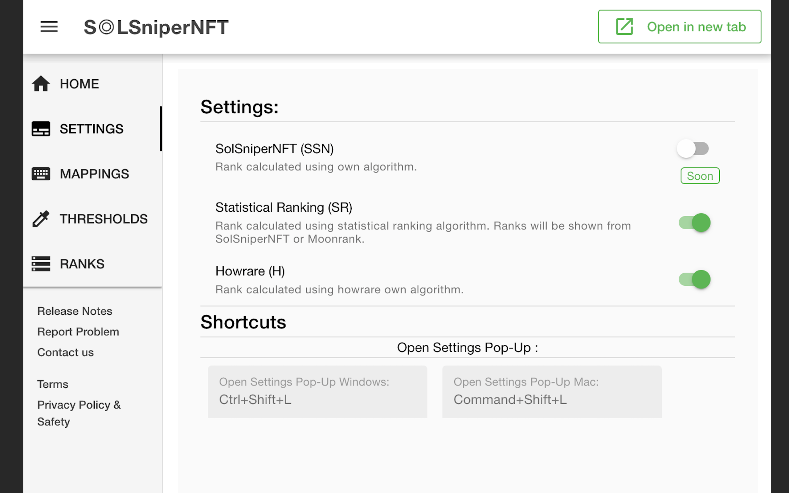

# S◎LSniperNFT-Releases

S◎LSniperNFT

You can buy me a beer: LMnqhR1Fof6qf6uU971AmhaDQQSveJUENMUnwmu167x 😆 🍻 (Sol address)
## Table of Contents

- [Features](#features)
- [Extension Settings](#extension-settings)
- [How to install](#how-to-install)
- [Supported Marketplaces](#supported-marketplaces)
- [Supported Ranking Sites](#supported-ranking-sites)
- [Supported Browsers](#supported-browsers)
- [Issues](#issues)
- [Future developments](#future-developments)
## Features

- Show ranks from howrare and moonrank on supported marketplaces.
    - Howrare has multiple ways of calculating ranking but we show only the following 3 types:
        - HR - this is howrare own ranking system more info  <a href="https://howrare.is/faq/#rarity_calculation">here </a>
        - ST - Statistical ranking more info <a href="https://howrare.is/faq/#statistical_rarity">here</a>
        - NT - Normalized traits more info <a href="https://howrare.is/faq/#trait_normalization">here</a>
    - Moonrank supports one type of ranking and this is calculated using statistical ranking system.
## Extension Settings

- The extension pop-up allows you to :
    - Enable/Disable ranks to be shown.
        
    - Enter your own thresholds and colors for colouring ranks.
    - Enter your own mappings. On mappings page you can enter your own mappings to make sure that we
    find the rankings. The names can be found at the end of the urls:
        - For example if we want to map The Tower collection on Magic Eden with rankings from Moonrank.
          - Magiceden link : https://magiceden.io/marketplace/the_tower
          - Moonrank link : https://moonrank.app/collection/towerdao
          - We will have to set in the popup for:
            - Marketplace Collection ID : the_tower
            - Moonrank Collection ID : towerdao
            

## How to install

- Download the Release 1.2 zip file , unzip it, and load the unziped folder into your browser.
- <a href="https://github.com/kcotoi/SOLSniperNFT-Releases/releases/download/release1.2/solsnipernft-v0.1.2-production.zip
">Link here</a>

## Supported Marketplaces

| Marketplace | Status |
| ----------- | ------ |
|  MagicEden  |   ✅   |
|  Alpha.art  |   ✅   |
|  Solanart   |   ✅   |

## Supported Ranking Sites

| Ranking Site | Status |
| ------------ | ------ |
|   Howrare    |   ✅   |
|   Moonrank   |   ✅   |

## Supported Browsers

| Browser           | Status |
| ----------------- | ------ |
| Chrome            |   ✅   |
| Mozilla Firefox   |   ✅   |
| Brave             |   ✅   |
| Microsoft Edge    |   ✅   |

## Issues

- Please let me know if you find any.

## Future developments

- Improve the UI. Currently the ranks are not shown very nice so this will be improved.

- When enabling/disabling ranks implement so that the change is reflected immediatly in the UI.

- Inform user that the ranking has not be found and should check if mapping is needed.

- Add option to set your own limits for coloring

- Add more mappings to the application

- Refactor code

- Improve performance of the extension

- Add other marketplaces and ranking sites

- Please let me know any of your wishes
## Release History

- 1.0 Initial Version

- 1.2 Release info:
    - Fixed bugs:
        - Issue with extension icon.

- 1.3 Release info:
    - New changes/ added features:
        - Thresholds - now you can set your own thresholds for colorouring and choose your own colors.
        - When you enable/disable ranks the changes are reflected immediatly in the UI.
        - Added mappings for collections that can be seen on howrare and don't follow a predictable pattern
        - Removed column for Moonrank in Mappings page as this is not needed from now on. 
    - Fixed bugs:
    	- Issue with magiceden when you switch to Activity tab and come back the ranks were not shown.
    	- Issue with magiceden when you go into detail page and come back the ranks were not shown.

